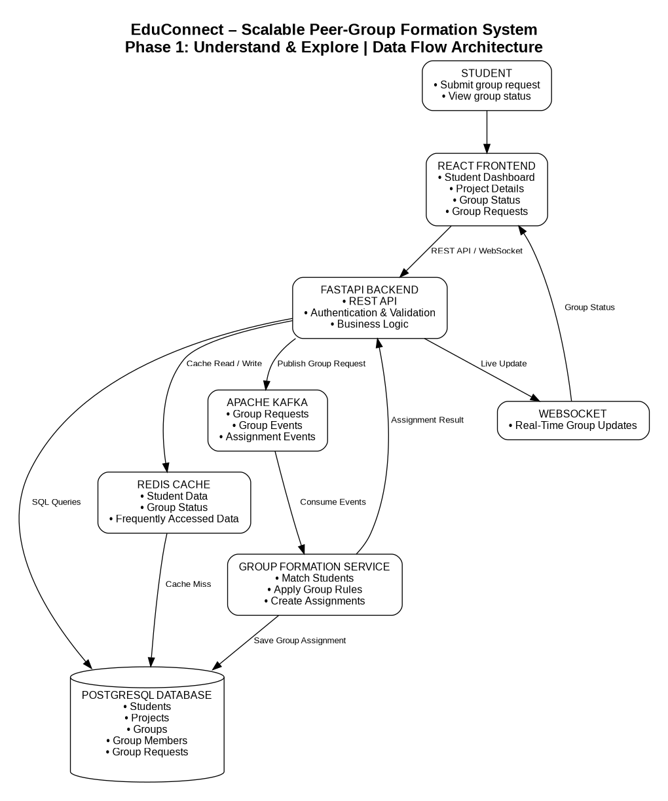

# EduConnect – Scalable Peer-Group Formation System

## Phase 1: Understand & Explore

### Project Overview

EduConnect is a scalable EdTech platform designed to efficiently form peer groups for collaborative academic projects. The system uses React, FastAPI, PostgreSQL, Redis, Apache Kafka, and WebSocket communication.

## Objective

The objective is to design a scalable and real-time peer-group formation system where student, project, and group data can flow efficiently between the database, backend services, and frontend.

## Technology Stack

* React
* FastAPI
* PostgreSQL
* Redis
* Apache Kafka
* WebSocket
* Docker
* TypeScript

## System Architecture

The system follows a vertical data flow:

**React Frontend → FastAPI Backend → PostgreSQL / Redis**

For asynchronous group formation:

**FastAPI → Kafka → Group Formation Service → PostgreSQL**

For real-time updates:

**Group Formation Service → FastAPI → WebSocket → React**

## Data Entities

### Student

Stores student profile information and preferences.

### Project

Stores collaborative project details and requirements.

### Group

Stores information about peer groups.

### Group Member

Maintains the relationship between students and their assigned groups.

### Group Request

Stores requests submitted by students for peer-group formation.

## Component Explanation

### React Frontend

Provides the student interface for viewing projects, submitting group requests, and monitoring group status.

### FastAPI Backend

Provides REST APIs, validates requests, handles authentication, and manages the application business logic.

### PostgreSQL

Acts as the primary persistent database for students, projects, groups, group members, and group requests.

### Redis

Provides fast caching for frequently accessed student and group information, reducing unnecessary database queries.

### Apache Kafka

Handles group formation requests and events asynchronously, allowing the system to process a large number of requests efficiently.

### Group Formation Service

Consumes Kafka events and applies the required matching and group formation logic before storing group assignments.

### WebSocket

Provides real-time updates to students when their group formation or assignment status changes.

## Data Flow

1. A student interacts with the React frontend.
2. React sends a request to the FastAPI backend.
3. FastAPI validates and processes the request.
4. Redis is checked for frequently accessed information.
5. PostgreSQL is used when persistent data is required.
6. Group formation requests are published to Apache Kafka.
7. The Group Formation Service consumes the event.
8. Students are matched according to the required grouping rules.
9. The resulting group assignment is stored in PostgreSQL.
10. FastAPI sends the updated status through WebSocket.
11. React displays the real-time group status to the student.

## Data Flow Diagram

## API Endpoints

The API endpoint design is documented in:

`api/endpoints.md`

Important endpoints include:

* `GET /api/students/{student_id}`
* `GET /api/projects`
* `GET /api/projects/{project_id}`
* `GET /api/groups`
* `GET /api/groups/{group_id}`
* `POST /api/groups`
* `POST /api/group-requests`
* `GET /api/group-requests/{request_id}`
* `WebSocket /ws/groups/{student_id}`

## Expected Outcome

The Phase 1 design establishes a clear data flow between the frontend, backend, database, cache, event-streaming system, and real-time communication layer.

This architecture provides a foundation for implementing the backend and frontend vertical slice in the next phases.
